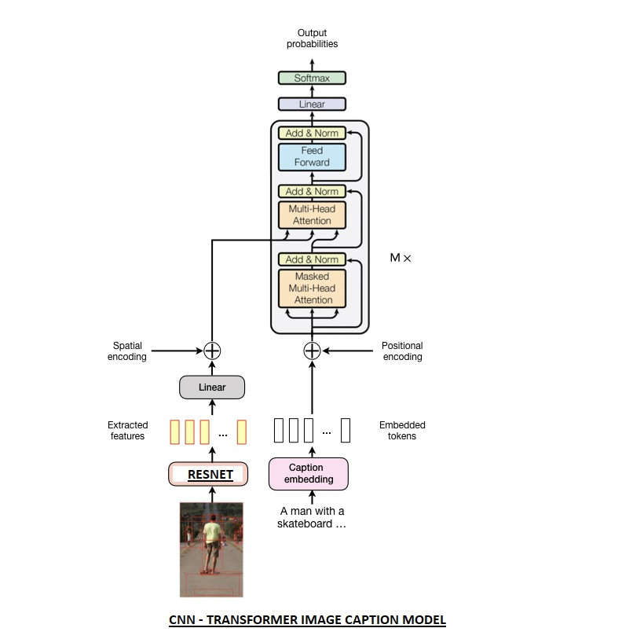
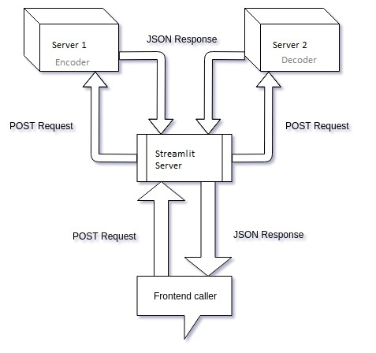

# Image Caption Generation
In this project we have implemented the encoder decoder network for image caption generation . 
The CNN model act as Encoder and the Transformer Decoder act as an Decoder

This model is deployed in Heroku .

The encoder is deployed as a REST service in SERVER 1  https://image-caption-server1.herokuapp.com

The decoder is deployed as a REST service in SERVER 2 https://image-caption-sever2.herokuapp.com

